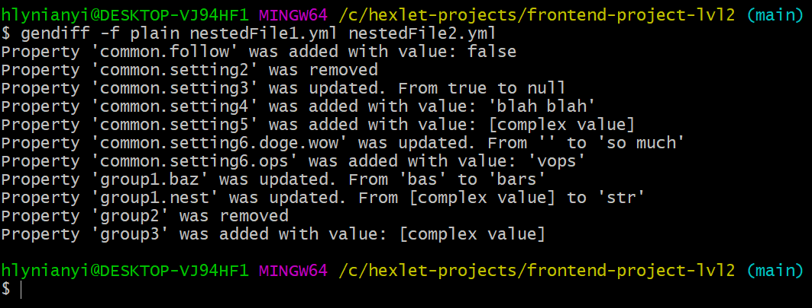
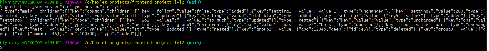

### Hexlet tests and linter status:
[](https://github.com/glinyany/frontend-project-lvl2/actions)
[](https://github.com/glinyany/frontend-project-lvl2/actions/workflows/linter-check.yml)
<a href="https://codeclimate.com/github/glinyany/frontend-project-lvl2/test_coverage"></a><a href="https://codeclimate.com/github/glinyany/frontend-project-lvl2/maintainability"></a>

<h1 align="center">Second Hexlet Project</h1>
<h3 align="center">A difference calculator(CLI application).</h3>
<h2>Description</h2>
<p>This project is a difference generator for json, yaml and ini files.</p>
<p>Can be used as a script or as a library in other projects.</p>
<p>Three format styles: stylish(default), plain and json.</p> 
<p>This is a popular task for which there are many online services, such as http://www.jsondiff.com/.</p>
<p>A similar mechanism is used when outputting tests or when automatically tracking changes in configuration files.</p>

## Setup

```sh
git clone https://github.com/glinyany/frontend-project-lvl2.git
cd frontend-project-lvl1/
make install
npm link (you may need sudo)
```

### Run tests

```sh
make test
```

<h2>Examples</h2>

<h3>stylish(default formatter)</h3>

<h3>plain</h3>

<h3>json</h3>

